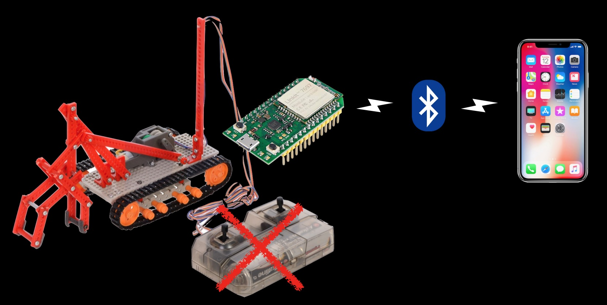
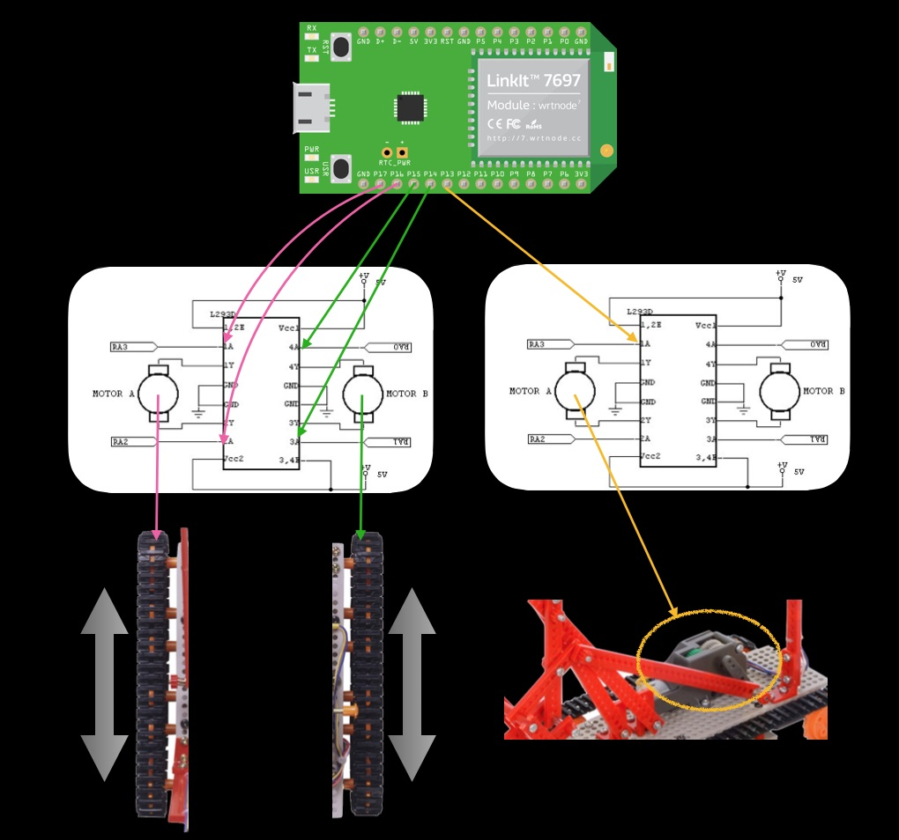
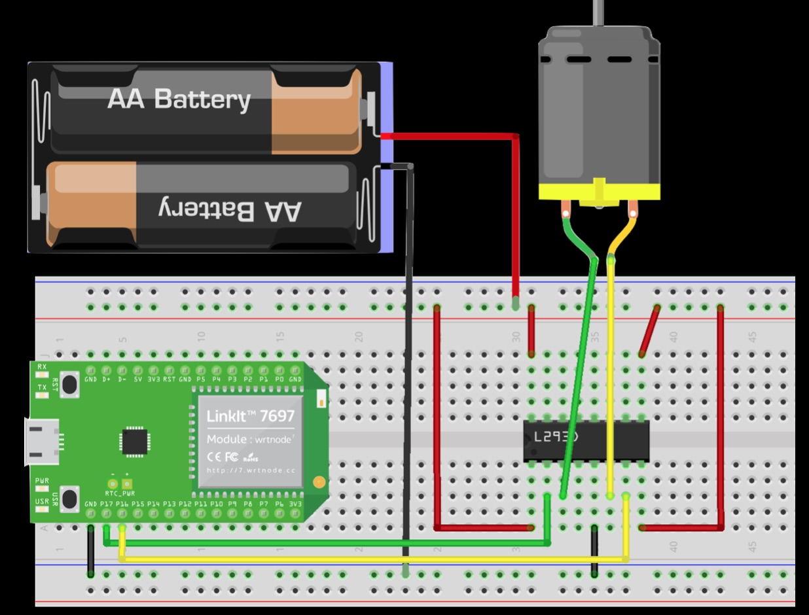
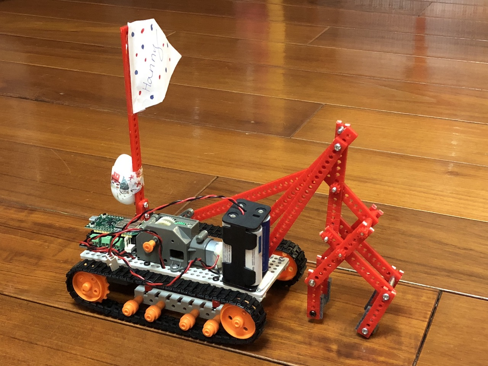
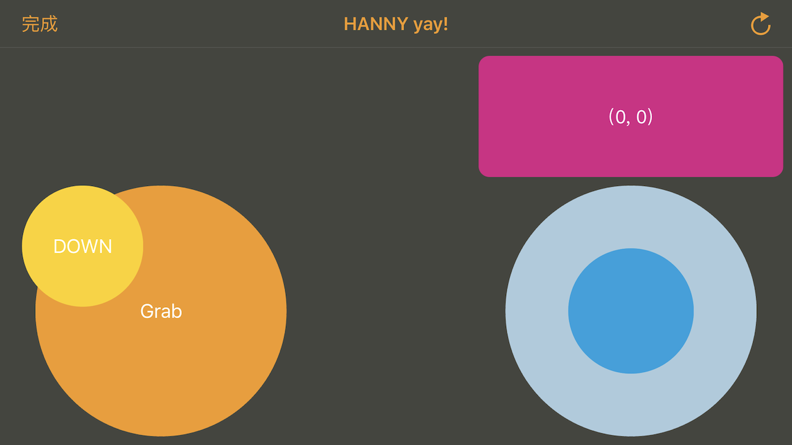
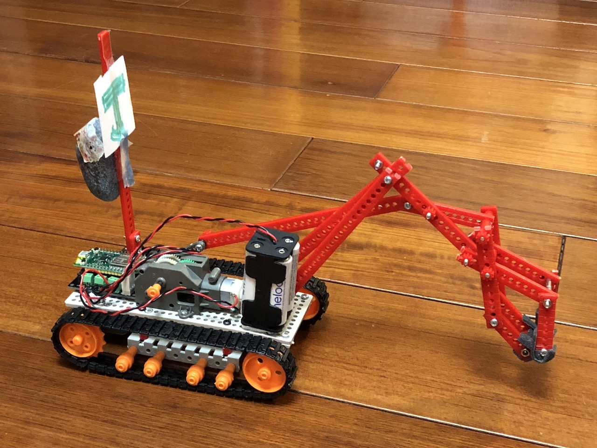
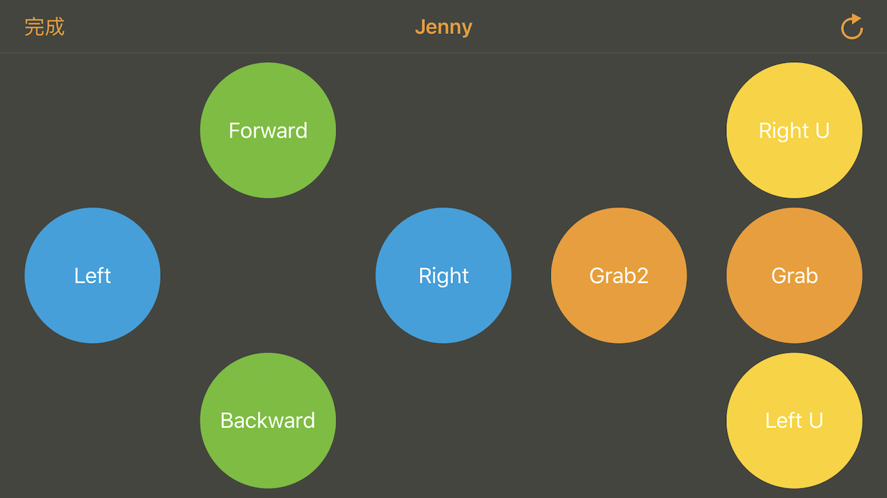

# 7697-Crawler
Tamiya 70170 crawler controlled remotely by BLE with linkit 7697 

Please check [Slideshare](https://www.slideshare.net/SmallpTsai/7697-crawler) for more detail

## Motor driver board

This project use 2 L293D to control 3 motors. 3 motors require 6 pin to control. Used pins are listed below:

| Motor | pin A | pin B |
|-------|-------|-------|
| Left  | 17    | 16    |
| Right | 15    | 14    |
| ARM   | 13    | 12    |

* [Schematic PDF](sch/7697_motor_driver_board.pdf)
* [Eagle Schematic](sch/7697_motor_driver_board.sch)
* [Eagle Layout](sch/7697_motor_driver_board.brd)

## Arduino Source code

### Template

[Source](CrawlerControl/CrawlerControl.ino)

### Hanny's Version

##### Control UI

[Source](Crawler_Hanny/Crawler_Hanny.ino)

### Jenny's Version

##### Control UI

[Source](Crawler_Jenny/Crawler_Jenny.ino)
